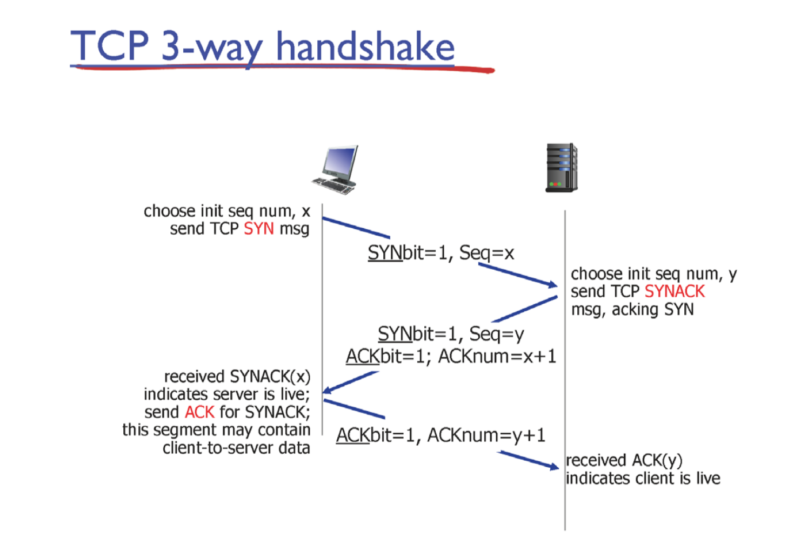
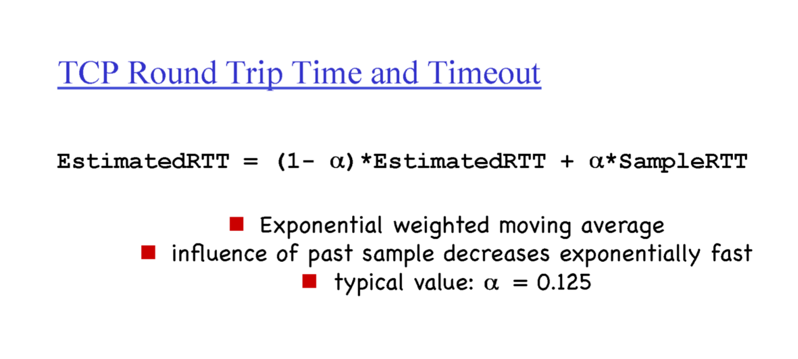
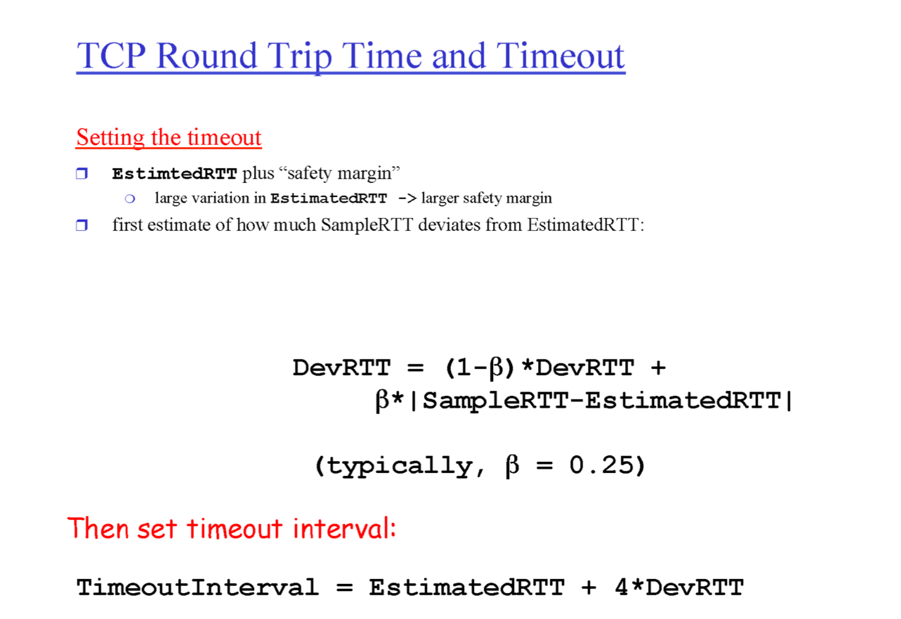
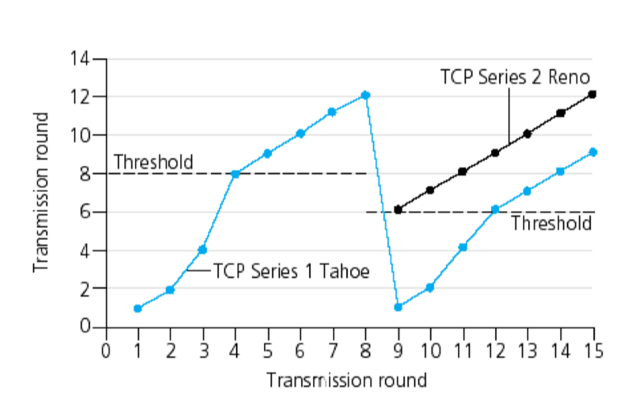

# Transport Layer 

Transport Layer는 애플리케이션 간의 데이터를 신뢰성 있게 전달하기 위해 여러 기능을 수행합니다. 여기에는 데이터의 세그멘테이션, 멀티플렉싱/디멀티플렉싱, 신뢰성 있는 전송 메커니즘 등이 포함됩니다.

---

## 1. 데이터 캡슐화 및 프로토콜 계층 구조

- **캡슐화 과정**:  
  애플리케이션 계층에서 생성된 데이터는 Transport Layer에서 세그먼트(segment)로 분할되며, 이어서 네트워크 계층의 패킷, 그리고 링크 계층의 프레임으로 캡슐화됩니다.

- **Transport Layer 세그먼트**:  
  세그먼트는 데이터와 헤더로 구성되며, 헤더는 다음과 같은 필드를 포함합니다.
  - **Source Port (16비트)**: 송신 프로세스 식별  
  - **Destination Port (16비트)**: 수신 프로세스 식별  
  - **Length (16비트)**: 헤더와 데이터의 전체 길이  
  - **Checksum (16비트)**: 오류 검출을 위한 값  
  - *참고*: 포트 번호는 16비트로 표현되므로 사용 가능한 범위는 0부터 65,535까지입니다.

- **계층별 캡슐화**:
  - **Application Layer**: 메시지(예: HTTP 요청/응답)
  - **Transport Layer (TCP/UDP)**: 세그먼트 생성 및 헤더 추가
  - **Network Layer (IP)**: 세그먼트를 패킷으로 캡슐화
  - **Link Layer**: 패킷을 프레임으로 캡슐화하여 물리적으로 전송

---

## 2. Multiplexing과 Demultiplexing

### Multiplexing (다중화)
- **정의**:  
  한 쪽에서 여러 애플리케이션 계층의 데이터를 하나의 통신 경로에 모으는 과정입니다.
- **목적**:  
  하나의 연결로 여러 애플리케이션의 데이터를 전송할 수 있도록 하여 효율성을 높입니다.

### Demultiplexing (역다중화)
- **정의**:  
  수신 측에서 하나로 합쳐진 데이터를 다시 개별 애플리케이션에 전달하기 위해 분리하는 과정입니다.

### UDP vs. TCP의 Demultiplexing 방식
- **UDP**:  
  - **기준**: 목적지 IP와 목적지 포트  
  - 단순하고 빠르지만 신뢰성을 보장하지 않습니다.
- **TCP**:  
  - **기준**: 송신 IP, 송신 포트, 목적지 IP, 목적지 포트 (4-튜플)  
  - 연결 지향적이며, 신뢰성 있는 데이터 전송을 보장합니다.

---

## 3. 신뢰성 있는 데이터 전송 (Reliable Data Transfer, RDT)

네트워크 하부는 불안정하기 때문에, Transport Layer는 데이터 전송의 신뢰성을 확보하기 위해 여러 알고리즘을 사용합니다.

### RDT 1.0
- **가정**: 모든 채널이 안전하다고 가정하여 오류나 손실이 발생하지 않는 경우에 사용

### RDT 2.0
- **오류 검출**: 체크섬을 사용해 수신 측에서 에러 여부 확인  
- **피드백 메커니즘**:  
  - **ACK (Acknowledgement)**: 정상 수신  
  - **NAK (Negative Acknowledgement)**: 오류 발생 시 재전송 요청  
- **재전송**: 오류가 발견되면 해당 패킷을 재전송

### RDT 2.1
- **중복 패킷 처리**: 모든 패킷에 Sequence Number를 부여하여 중복 여부와 순서를 확인  
- **최소 시퀀스 번호 공간**: 1개씩 전송 시 이진수(0, 1)만으로도 충분

### RDT 2.2
- **패킷 손상 고려**: 에러, 중복, 순서 오류 뿐만 아니라 패킷 손상까지 고려한 개선된 방식

### RDT 3.0
- **패킷 손실까지 고려**: ACK가 일정 시간 내에 도착하지 않으면 손실된 것으로 간주하고 재전송  
- **타이머 도입**: 타이머를 적절히 설정해 네트워크 상황에 따라 재전송을 결정

---

## 4. 파이프라인 프로토콜

단일 패킷 전송 후 ACK를 기다리는 방식보다, 여러 패킷을 동시에 전송하여 네트워크 활용도를 높이는 방법입니다.

### Go-Back-N (GBN)
- **원리**:  
  - 윈도우 크기 N만큼 연속된 패킷을 전송  
  - 수신 측은 마지막으로 순차적으로 받은 패킷 번호를 ACK로 전송
- **재전송**:  
  패킷 손실이 발생하면 손실된 패킷부터 이후의 모든 패킷을 재전송
- **버퍼 필요**: 송신 측은 아직 ACK를 받지 못한 패킷을 버퍼에 저장

### Selective Repeat (SR)
- **원리**:  
  - 손실된 패킷만 선택적으로 재전송하여 효율성을 극대화  
  - 수신 측은 도착한 패킷을 임시 저장한 후, 순서대로 애플리케이션에 전달
- **시퀀스 번호**:  
  윈도우 크기 N에 대해 최소 2N개의 시퀀스 번호가 필요하여 혼동을 방지

---

## 5. TCP 프로토콜의 주요 메커니즘

TCP는 신뢰성 있는 데이터 전송을 위해 다음과 같은 여러 기능을 갖추고 있습니다.

### TCP 세그먼트 구성
- **헤더 필드**:  
  - Source Port, Destination Port  
  - Sequence Number: 데이터의 순서를 보장  
  - Acknowledgment Number: 수신 확인  
  - Checksum: 오류 검출  
  - 기타: 윈도우 크기, Urgent pointer, 옵션 등

### 연결 설정 – 3-Way Handshake
- **SYN**: 클라이언트가 서버에 연결 요청(시퀀스 번호 포함)
- **SYN-ACK**: 서버가 연결 요청에 대한 응답 및 확인
- **ACK**: 클라이언트가 최종 확인을 보내면서 연결 성립
- **왜 3-Way인가?**: 2-Way Handshake는 양방향 연결 설정에 취약하여, 추가적인 확인 단계가 필요합니다.

### 연결 종료
- **4-Way Handshake**:  
  양쪽에서 종료 요청을 주고받으며 연결을 종료  
- **TIME_WAIT 상태**:  
  마지막 ACK 전송 후 일정 시간 대기하여, 지연된 패킷이 새 연결에 영향을 주지 않도록 함

### Flow Control (흐름 제어)
- **원리**:  
  수신 측의 버퍼 상태를 TCP 헤더의 윈도우 크기 필드에 명시하여, 송신 측이 과도한 데이터를 보내지 않도록 조절

### Fast Retransmit 및 Fast Recovery
- **Fast Retransmit**:  
  동일한 ACK가 연속적으로 도착하면, 해당 ACK 이후의 패킷 손실을 추정하여 재전송
- **Fast Recovery**:  
  손실 이후 혼잡 윈도우를 절반으로 줄이고, 이후 선형적으로 증가시켜 빠른 회복을 도모

---

## 6. TCP 혼잡 제어

네트워크 전체의 혼잡을 관리하기 위해 TCP는 혼잡 제어 알고리즘을 사용합니다.

### TCP Tahoe
- **Slow Start**:  
  초기 윈도우 크기를 작게 시작하여, 매 RTT마다 지수적으로 증가 (1, 2, 4, 8, …)
- **Congestion Avoidance (Additive Increase)**:  
  임계값(threshold)에 도달하면 선형적으로 윈도우 크기를 증가
- **Multiplicative Decrease**:  
  패킷 손실 시 혼잡 윈도우 크기를 급격히 감소시키고 임계값을 조정

### TCP Reno
- **개선점**:  
  - Fast Retransmit 및 Fast Recovery 기법을 도입하여, 패킷 손실 시 보다 빠르게 회복  
  - 혼잡 윈도우를 절반으로 줄인 후 선형 증가
- **효율성**:  
  Tahoe보다 재전송 및 회복 과정에서 네트워크 자원을 더 효율적으로 사용

---

