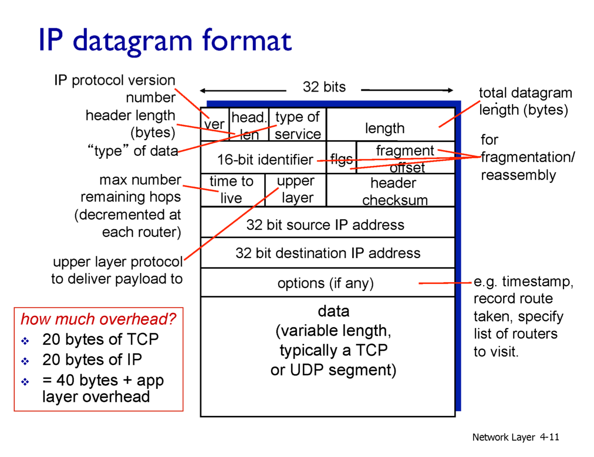

# Network Layer

라우터까지 어떻게 패킷을 전송할 것인가?

- **포워딩 (Forwarding)**  
  들어온 패킷의 목적지 주소와 포워딩 테이블(Lookup Table)을 참고하여 패킷을 어느 인터페이스로 보낼지 결정하는 기능입니다.
  - **역할:**  
    - 패킷 헤더의 목적지 IP 주소 확인  
    - 포워딩 테이블에서 목적지와 일치(또는 가장 긴 접두사 매칭되는)하는 엔트리를 찾음  
    - 해당 인터페이스로 패킷을 전송
  - **특징:**  
    - 실제 패킷 전송 속도에 직접적인 영향을 주며, 하드웨어 혹은 소프트웨어로 구현될 수 있음

- **라우팅 (Routing)**  
  패킷이 목적지까지 도달할 수 있도록 전체 네트워크 경로를 결정하는 개념입니다.
  - **역할:**  
    - 네트워크 토폴로지 정보를 수집  
    - 최적의 경로(혹은 정책에 따른 경로)를 결정하여 라우팅 테이블 구성  
    - 동적 라우팅 프로토콜(OSPF, BGP, RIP 등)을 통해 경로 정보를 업데이트
  - **포워딩과의 차이:**  
    - 라우팅은 경로 결정과 테이블 생성에 관한 전반적인 정책과 알고리즘을 포함  
    - 포워딩은 결정된 경로를 실제로 따라 패킷을 전달하는 과정

> **핵심:** 포워딩 테이블에서 가장 구체적(가장 긴 접두사 매칭)의 목적지 엔트리를 찾아 해당 인터페이스로 패킷을 전송한다.

---

## IP Datagram Format

- **IP 데이터그램**은 네트워크 계층에서 사용되는 기본 데이터 전송 단위입니다.
- **주요 필드:**  
  - **Version:** IPv4 또는 IPv6 등의 버전  
  - **Header Length:** IP 헤더의 길이 (옵션 포함 여부에 따라 달라짐)  
  - **Type of Service/DSCP:** 서비스 품질(QoS) 및 우선순위 설정  
  - **Total Length:** 전체 데이터그램 길이 (헤더+데이터)  
  - **Identification, Flags, Fragment Offset:** 패킷 분할(프래그먼테이션) 관련 정보  
  - **TTL (Time to Live):** 패킷이 네트워크 내에서 머무를 수 있는 최대 시간/홉 수  
  - **Protocol:** 상위 계층 프로토콜 (예: TCP, UDP, ICMP 등)  
  - **Header Checksum:** 헤더 오류 검출  
  - **Source IP Address** 및 **Destination IP Address:** 발신자와 수신자의 IP 주소  
  - **옵션:** 선택적 기능 (예: 보안, 라우팅)

---

## IPv4

- **주소체계:**  
  - 32비트 주소체계를 사용하며, 총 2^32개의 고유한 IP 주소 표현 가능
- **표현 방식:**  
  - 점(.)으로 구분된 4개의 옥텟 (예: 192.168.1.1)
- **주요 특징:**  
  - 서브넷 마스크를 이용해 네트워크와 호스트 부분을 구분  
  - IP 주소는 주로 네트워크 인터페이스를 식별하는 데 사용되며, 하나의 라우터는 여러 개의 인터페이스와 IP 주소를 가질 수 있음

---

## IPv6

- **주소체계:**  
  - 128비트 주소체계를 사용하며, 2^128개의 고유한 IP 주소 제공
- **표현 방식:**  
  - 8개의 16비트 블록을 콜론(`:`)으로 구분 (예: 2001:0db8:85a3:0000:0000:8a2e:0370:7334)
- **향상된 기능:**  
  - 주소 부족 문제 해결, 더 효율적인 라우팅, 보안 및 모빌리티 지원
- **헤더 구조:**  
  - 단순화된 헤더 구조로 라우터 처리 속도 향상  
  - 옵션 필드는 확장 헤더로 처리

---

## Grouping Related Hosts

- **Network ID (또는 Prefix / 서브넷 ID):**  
  - 네트워크에 속한 모든 호스트가 공유하는 주소 부분  
  - 예: 서브넷 마스크 255.255.255.0 (즉, /24)는 첫 24비트가 네트워크 ID임을 나타냄
- **Host Identifier:**  
  - 네트워크 내에서 개별 호스트를 구분하는 부분  
  - 예: /24 서브넷의 경우 나머지 8비트가 호스트 식별에 사용됨
- **Longest Prefix Match:**  
  - 라우터가 패킷을 전달할 때, 포워딩 테이블 내에서 목적지와 가장 긴 접두사로 일치하는 경로를 선택하는 기법

---

## Subnets

- **서브넷의 개념:**  
  - 하나의 큰 네트워크를 여러 개의 작은 네트워크(서브넷)로 분할하는 방법
- **특징:**  
  - 같은 서브넷 내의 호스트들은 라우터를 거치지 않고 직접 통신 가능  
  - 서브넷 마스크에 의해 네트워크 ID 부분이 동일한 호스트들은 같은 서브넷에 속함
- **이점:**  
  - 네트워크 트래픽 관리 및 보안 강화  
  - 효율적인 IP 주소 할당 및 네트워크 관리

---

## NAT (Network Address Translation)

- **개념:**  
  - 사설 IP 주소와 공인 IP 주소 간의 변환 기술
- **역할:**  
  - 내부 네트워크의 IP 주소를 외부에 노출하지 않으면서 인터넷 통신 가능  
  - 주소 부족 문제 해결 및 보안 강화
- **작동 방식:**  
  - 라우터 또는 방화벽에서 패킷의 출발지/목적지 IP 주소 변경  
  - 상태 정보를 유지하여 응답 패킷을 올바른 내부 호스트로 전달

---

## Dynamic Host Configuration Protocol (DHCP)

- **개념:**  
  - 네트워크 내에서 IP 주소, 서브넷 마스크, 기본 게이트웨이, DNS 서버 등의 정보를 자동으로 할당해 주는 프로토콜
- **작동 과정:**  
  - DHCP Discover → DHCP Offer → DHCP Request → DHCP Acknowledge 순서로 IP 주소가 할당됨
- **이점:**  
  - 네트워크 관리자의 수동 설정 부담 경감  
  - 동적 IP 주소 관리 가능

---

## ICMP (Internet Control Message Protocol)

- **개념:**  
  - IP 네트워크에서 발생하는 에러와 제어 정보를 전달하기 위한 프로토콜
- **주요 용도:**  
  - 네트워크 진단 도구 `ping`과 `traceroute`의 기반 프로토콜  
  - 패킷 전달 과정에서 발생하는 문제(예: 목적지 도달 불가, TTL 초과 등)를 알림
- **메시지 타입:**  
  - Echo Request/Reply, Destination Unreachable, Time Exceeded 등

---

## IPv6 (추가 설명)

- **추가 특징:**  
  - 자동 구성 (Stateless Address Autoconfiguration, SLAAC)  
  - IPSec 지원이 필수  
  - 향상된 멀티캐스트 지원
- **패킷 구조 변경:**  
  - 단순화된 헤더 구조로 인해 라우터의 처리 속도 향상  
  - 옵션 처리는 확장 헤더를 통해 수행

---

## 라우팅 알고리즘

### Link State Algorithm

- **개념:**  
  - 각 라우터가 네트워크 내 전체 토폴로지 정보를 수집한 후, 자신과 다른 모든 노드 사이의 최단 경로를 계산하는 방식
- **대표 알고리즘:**  
  - **다익스트라 알고리즘 (Dijkstra's Algorithm)**
- **특징:**  
  - 모든 라우터가 동일한 링크 상태 데이터베이스를 유지  
  - 빠른 경로 계산 가능  
  - 초기 토폴로지 정보 수집 시 부하 발생 가능

### Distance Vector Algorithm

- **개념:**  
  - 각 라우터가 인접 라우터와 최단 경로 정보를 주기적으로 교환하며, 목적지까지의 최단 경로를 계산하는 방식
- **대표 알고리즘:**  
  - **벨만-포드 알고리즘 (Bellman-Ford Algorithm)**
- **특징:**  
  - 구현이 단순하며, 라우터 간 정보 교환이 주기적으로 이루어짐  
  - 느린 수렴 및 루핑 문제 등 단점 존재  
  - 작은 네트워크에 적합

---

## 내부적 라우팅 (Intra-AS)와 외부적 라우팅 (Inter-AS)

내부적 라우팅은 한 개의 자율 시스템(Autonomous System, AS) 내에서 최적의 경로를 결정하는 방식이며, 위에서 설명한 두 가지 알고리즘(링크 상태 알고리즘과 거리 벡터 알고리즘)을 주로 사용. 최종 라우팅 도착지는 내부와 외부 프로토콜을 통해 결정된다.

### 계층적 라우팅

- **내부적 라우팅 (Intra-AS Protocol):**  
  한 AS 내부에서 라우팅 정보를 교환하여 최적 경로를 결정하는 프로토콜입니다.
  - **RIP (Routing Information Protocol):**  
    - **유형:** 거리 벡터 프로토콜  
    - **특징:** 주기적인 전체 라우팅 테이블 업데이트, 최대 홉 수 제한(15 홉)  
    - **적용:** 작은 네트워크에 적합
  - **OSPF (Open Shortest Path First):**  
    - **유형:** 링크 상태 프로토콜  
    - **특징:** 네트워크 전체 토폴로지 정보를 기반으로 다익스트라 알고리즘을 사용하여 최단 경로 계산  
    - **적용:** 규모가 큰 네트워크에 적합하며, 영역(Area) 분할을 통해 확장성 제공

- **최종 라우팅 도착지 (Inter-AS Protocol):**  
  서로 다른 AS 간의 경로 정보를 교환하여 최종 경로를 결정하는 프로토콜입니다.
  - **BGP (Border Gateway Protocol):**  
    - **유형:** 경로 벡터 프로토콜  
    - **특징:** 정책 기반 라우팅 지원, 각 AS 간의 경로 정보 교환  
    - **적용:** 인터넷 전체의 라우팅을 관리하며, 복잡한 라우팅 정책을 구현

